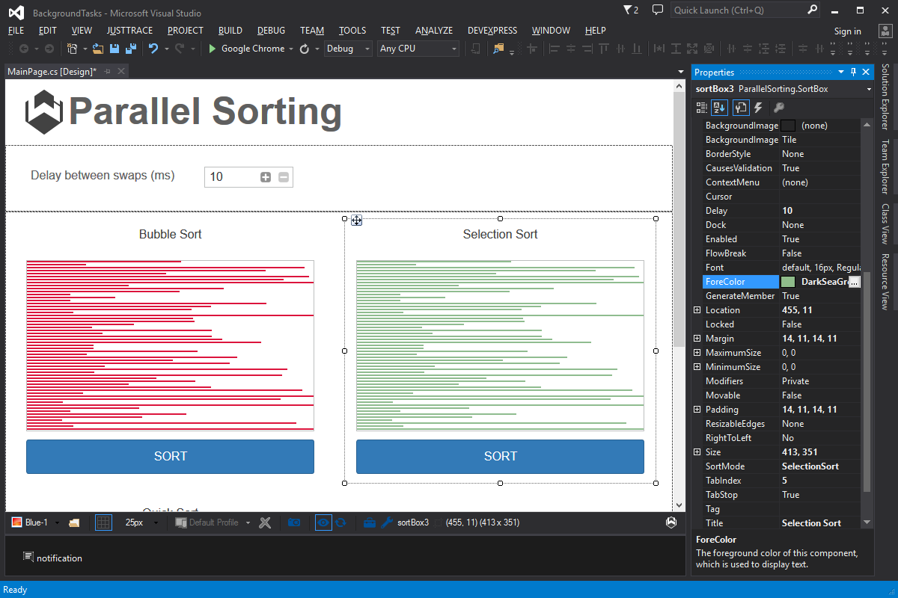

Background Tasks
====

This very ambitious example uses background tasks, canvas drawing, flow layout, and the desktop notification extension to show off multiple tasks running in the background and all updating the client at the same time.

License
-------
 Copyright (C) ICE TEA GROUP LLC, All rights reserved.
