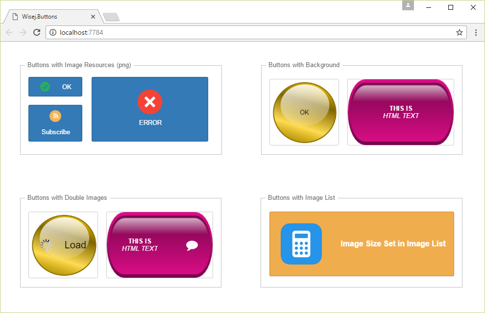

Buttons
====

This example shows how to use the several image properties with the Wisej.Web.Button control. The same concepts work with all controls with the same image properties.

License
-------
 Copyright (C) ICE TEA GROUP LLC, All rights reserved.
