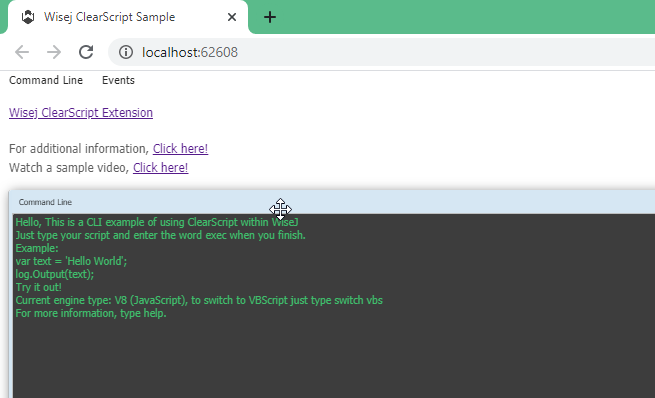

ClearSCript
====

Shows how to use the [ClearScript](https://github.com/iceteagroup/wisej-extensions/tree/master/Wisej.Web.Ext.ClearScript) Wisej extension. This amazing extension to Wisej adds full support for server-side scripting using either VBScript, JScript or the latest Google V8 JavaScript engine. Scripts can access any object or class in the application and can attach to events fired by Wisej controls. Refer to [Microsoft’s ClearScript Reference](https://microsoft.github.io/ClearScript/Reference/html/R_Project_Reference.htm) for the ClearScript reference.

License
-------
 Copyright (C) ICE TEA GROUP LLC, All rights reserved.
