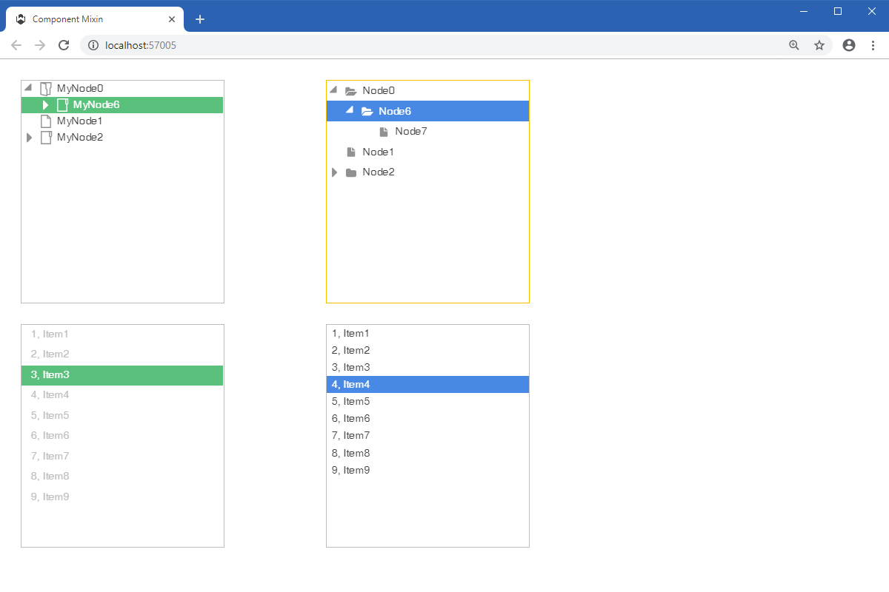

Component Mixin
====

Shows how to use mixins to have two or more appearances for TreeView and ListBox on the same application.

## 1. About mixins

A mixin is a partial theme definition. It extends or overrides the application theme, no matter what theme is used by the application.

A mixin file must be named <arbitrary_mixin_name>__.mixin.theme__ and must in the __/Themes__ folder. The __Build Action__ can be set to __Embedded Resource__, __Content__ or __None__. This project uses the later option.

Even if the theme or mixin files are an __Embedded Resource__, you don't need to recompile the application to change them. To override a theme or mixin files on runtime, just change the files in the __/Themes__ folder.

Embedded themes and mixins in __other assemblies__ are loaded only when the __[assembly:WisejResources]__ attribute is present in __AssemblyInfo.cs__ file.

A mixin must be created in Visual Studio and it may be edited in the ThemeBuilder. Please refer to [Edit Mixins](https://wisej.com/docs/html/EditMixins.htm) on Wisej Documentation.

## 2. Embedding JavaScript files

As explained at [JavaScript](https://wisej.com/docs/html/JavaScript.htm) on Wisej Documentation, if you aren't using the __JavaScript Extender__ and want to embed a JavaScript file, you must follow 3 rules:

1. Place the __.js__ file under __/Resources__ or __/Platform__ folder.
2. Set the __.js__ file __Build Action__ to __Embedded Resource__.  
   Right click __Properties__ and set __Build Action__ to __Embedded Resource__.
3. Add the __[assembly:WisejResources]__ attribute to __AssemblyInfo.cs__ file.

