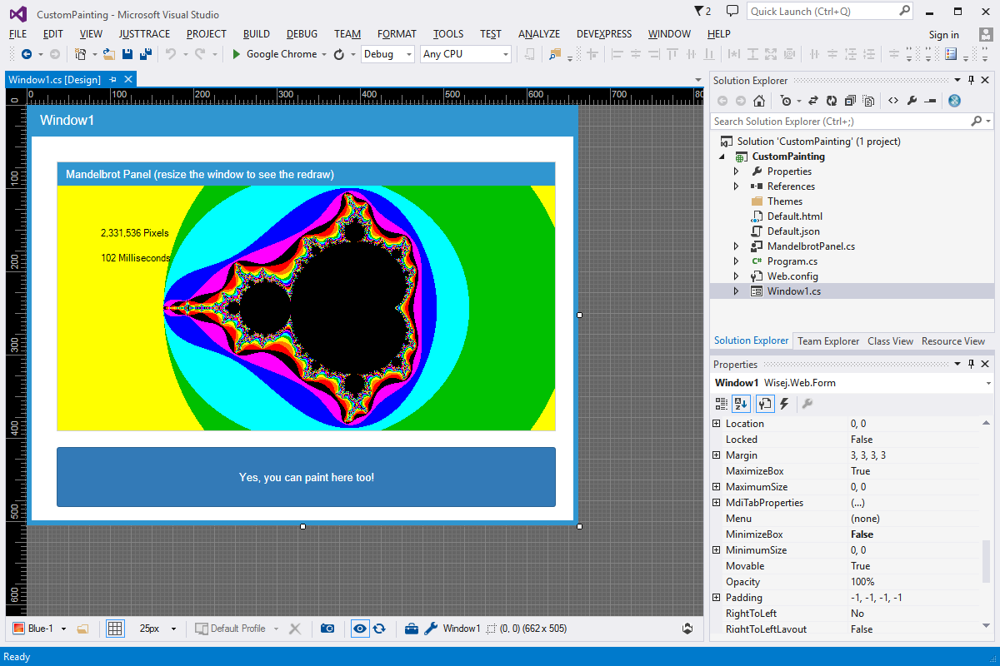

Custom Painting
====

Shows one of the many unique features of Wisej: Custom Painting. You can draw using basic GDI on the surface of any widget. This is one of the most powerful functionality in Wisej, along with Custom Drawing, Real Time Updates, and Background Tasks.

License
-------
 Copyright (C) ICE TEA GROUP LLC, All rights reserved.
