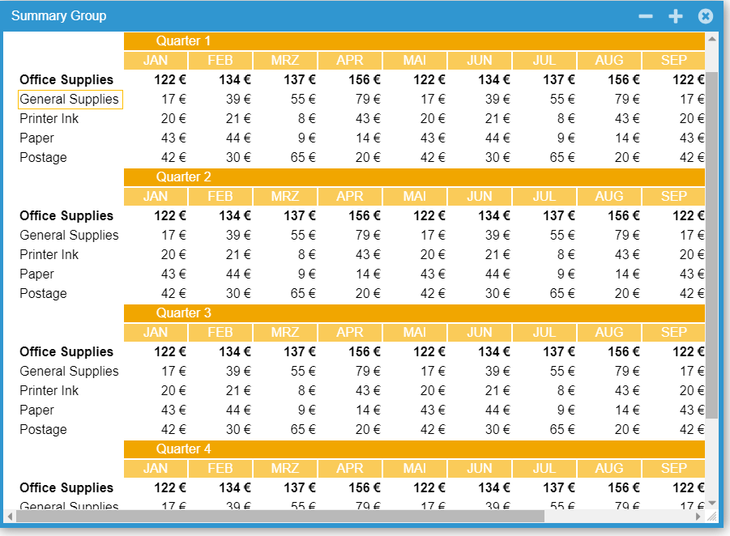

DataGridViewSummaryRows
====

Example that adds a new method to the DataGridView to automatically generate subtotal and summary rows using several different aggregation models.

VB.NET
------
The VB.NET version is [here](https://github.com/iceteagroup/wisej-examples-vb/tree/main/DataGridViewSummaryRows)

License
-------
 Copyright (C) ICE TEA GROUP LLC, All rights reserved.
