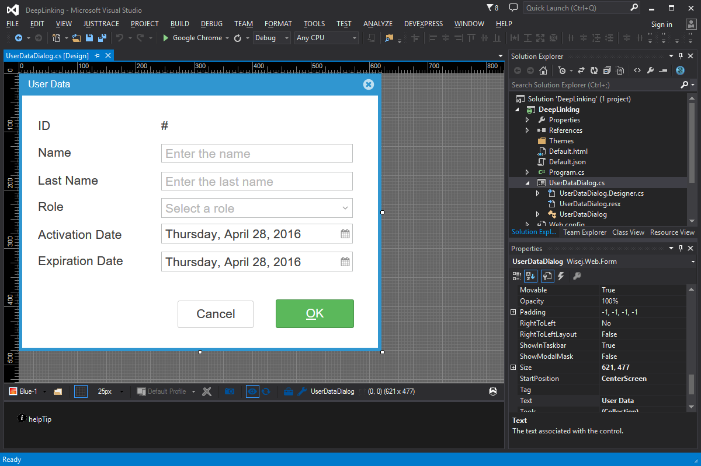

Deep Linking
====

A common issue for all Single Page Application (SPA) frameworks is the lack of URLs that can define a specific state: i.e. http://localhost/myapp?customer_id=34. Wisej includes full support for deep linking using the hash value in the URL, both on the client and the server side (i.e. http://localhost#id=34).

License
-------
 Copyright (C) ICE TEA GROUP LLC, All rights reserved.
