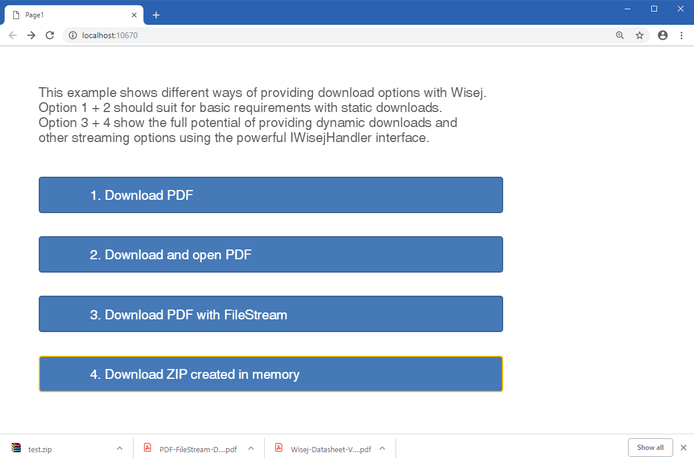

Download
====

This example shows different ways of providing download options with Wisej. The options `Download` and `DownloadAndOpen` should suit for basic requirements with static downloads. Dynamic downloads options include download based on a FileStream and download of a ZIP file created in memory.

License
-------
 Copyright (C) ICE TEA GROUP LLC, All rights reserved.
