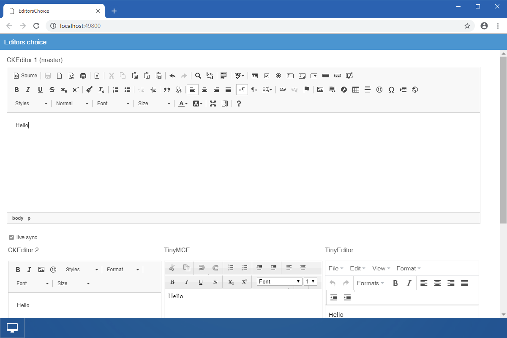

Editors Choice
====

Example of using 3 Wisej extensions for formatted text editors: [CKEditor](https://github.com/iceteagroup/wisej-extensions/tree/master/Wisej.Web.Ext.CKEditor), [TinyMCE](https://github.com/iceteagroup/wisej-extensions/tree/master/Wisej.Web.Ext.TinyMCE) and [TinyEditor](https://github.com/iceteagroup/wisej-extensions/tree/master/Wisej.Web.Ext.TinyEditor). Use it to explore the different features of all 3 edit controls. When Live Sync is checked, changes you apply in CKEditor1 control are directly reflected in real time in the 3 lower edit controls.

Uses 3rd party JavaScript library:
- [CKEditor](https://ckeditor.com)
- [TinyMCE](https://www.tiny.cloud)
- [TinyEditor](https://github.com/jessegreathouse/TinyEditor)

## [Blog](https://wisej.com/blog/editors-choice/)

## [Try it on Online](http://demo.wisej.com/EditorsChoice)

License
-------
 Copyright (C) ICE TEA GROUP LLC, All rights reserved.
