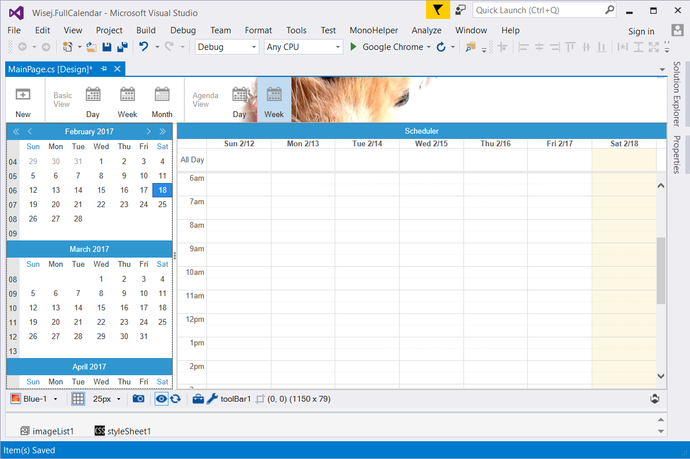

FullCalendar
====

This example shows how to use the [FullCalendar](https://github.com/iceteagroup/wisej-extensions/tree/master/Wisej.Web.Ext.FullCalendar) Wisej extension and the StyleSheet extender together with the MonthCalendar control and a ComboBox with HTML items.

Uses 3rd party JavaScript library [FullCalendar](https://fullcalendar.io/)

## [Try it on Online](http://demo.wisej.com/FullCalendar)

License
-------
 Copyright (C) ICE TEA GROUP LLC, All rights reserved.
