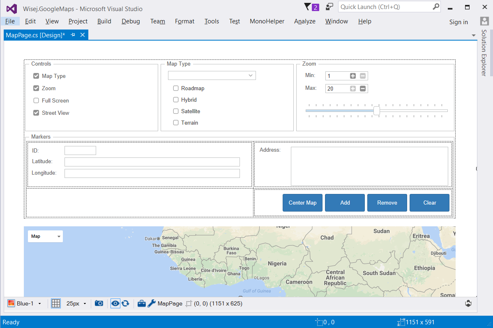

GoogleMaps
====

This example shows how to use the [GoogleMaps](https://github.com/iceteagroup/wisej-extensions/tree/master/Wisej.Web.Ext.GoogleMaps) Wisej extension, set the options, add markers, receive map events on the server, use coordinates and addresses for geocoding, get geocode information, and more.

Uses 3rd party online JavaScript library [Google Maps](https://cloud.google.com/maps-platform/)

License
-------
 Copyright (C) ICE TEA GROUP LLC, All rights reserved.
