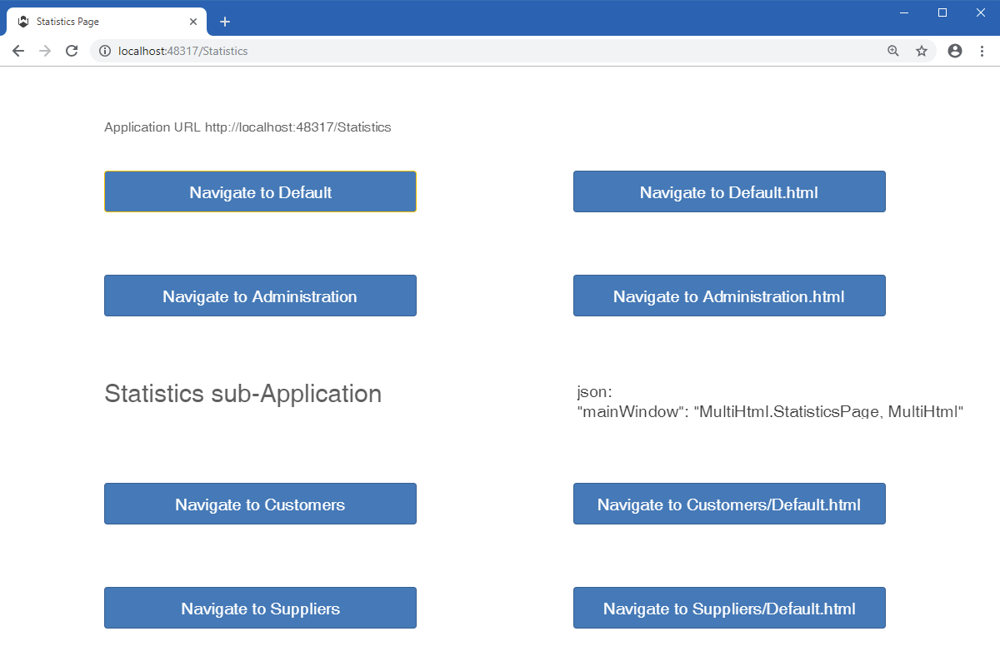

Html, Json and Main
====



Shows different entry points in your application, using `.json` and `.html` files, as well as using `mainWindow` instead of `startup` in the json file.

## 1. Context

The most common Wisej applications (in the broad sense) have only a single application (in the strict sense). To keep things simple, we will use __sub-application__ to refer to an application __in the strict sense__.

Wisej __sub-applications__ are different entry points in your application, independent URL you can use for whatever purpose you decide.

All Wisej projects must have at least one sub-application that is created by default.

## 2. About the startup files and their use

When you create a new Wisej project, Wisej creates 3 startup files:
* Default.html
* Default.json
* Program.cs

Notes
* The filename __Default.html__ is used because that’s the filename we are used to, for a startup page in ASP.NET.
* The filename __Program.cs__ is used because that’s where we look for the _static_ (_Shared_ in VB) __Main__ method in WinForms.
* For simplicity, the __.html__ and __.json__ filenames should match, but they don't have to match.

These names can be changed. The [ChangedNames project](https://github.com/iceteagroup/wisej-examples/tree/master/HtmlJsonAndMain/ChangedNames) is an example of changing the __.html__ and __.cs__ filenames.

### 2.1. Creating sub-applications

You can create a sub-application in the project's root or in a project's folder.

To create a sub-application, follow the steps:
1) Right click on the project (or a project's folder), selecting __Add => New Item__.
2) On the __Add New Item__ form, select __Wisej__ on the left side and click on __Application__ in the object list.
3) Set the application __Name__ and click __Add__.

Supposing you set the Name to __Admin__, Wisej creates 3 startup files, all with the same name:
* Admin.html
* Admin.json
* Admin.cs

The __Admin.cs__ file is just like the __Program.cs__ default file and looks like this: 
```csharp
static class Admin
{
    static void Main()
    {
    }
}
```


### 2.2. Running sub-applications

We are trained to look for the __.html__ file as the starting point for a web application. In fact, the Wisej sub-application starts by the __.json__ file. Even when we type an URL that includes the __.html__ part, Wisej looks for is the __.json__ file. Later on, we will discuss the rules Wisej uses to get a __.json__ file.

In the __Admin__ sub-application we created, the __Admin.json__ file looks like this:
```json
{
	"url": "Admin.html",
	"startup": "[ProjectName].Admin.Main, [ProjectName]"
}
```

This file tells Wisej two important pieces of information:
* What __.html__ file to show on the browser - the __"url"__ key.
* What startup method to run on the server - the __"startup"__ key.

Notes
* Browsers need an HTML-like file and Wisej needs the browser to load and execute __wisej.wx__. More on this later.
* Instead of the startup method, we can specify the sub-application's main view. More on this later.

#### 2.2.1. Showing an HTML-like file on the browser

In the __Admin__ sub-application we created, the __Admin.html__ file will include a line like this:
```html
<script src="wisej.wx"></script>
```
This line is very important, because it bootstraps the browser (client) part of Wisej. Without this line, the Wisej sub-application won't run.

The __HTML-like__ file can use any extension you want:
* .html
* .htm
* .aspx
* .cshtml
* .php
* anything that the browser can load.

All Wisej needs is the browser to load and execute the __wisej.wx__ bootstrap script.

#### 2.2.2. What method should the server execute

Wisej also needs to know what method the server should execute on startup, in this case the method __[ProjectName].Admin.Main__ on assembly __[ProjectName]__.

Say that instead of executing the __Main__ method, we want to instantiate an __AdminPage__. In fact, most of the time, all the __Main__ method does is instantiate a view (Form or Page). In this case, __Admin.json__ file should look like:

```javascript
{
    "url": "Admin.html",
    "mainWindow": "[ProjectName].AdminPage, [ProjectName]"
}
```

### 2.3. Wisej startup workflow

Putting it all together, you will find the Wisej startup workflow quite simple. It's composed of the following steps:
1) Find a __.json__ file.
2) Tell the browser to load and show __"url"__ HTML-like file.
3) Tell the server what to do, according to the key specified in the __.json__ file:
    * Execute the __"startup"__ method or
    * Instantiate (invoke the constructor of) the __"mainWindow"__ view.

## 3. Rules for finding the .json file

1) Replace the extension by __.json__  
If you type an URL that ends with an extension (html or any other extension), like __http://myserver.com/Startup.php__, if the file exists, Wisej tries to find the matching __.json__ file (a file with the same name, but with the json extension instead of supplied extension). In this case it looks for __\Startup.json__. If Wisej is already loaded and Wisej can not find a matching json file, the __wisej.wx__ script reloads the same page.

2) Append __Default.json__ to a folder path  
If you type an URL that refers to a folder, be it the root folder __http://myserver.com__ or an URL that ends with "/" like __http://myserver.com/Suppliers/__, Wisej uses __Default.json__ file at the specified folder location. In these cases, respectively at __\Default.json__ and at __\Suppliers\Default.json__.

3) Append either __.json__ extension or __\Default.json__  
If you type an URL that does __NOT__ end with any extension like __http://myserver.com/Customers__, Wisej tries to find the __.json__ file in two steps:
    * Wisej appends __.json__ to __Customers__ and looks for __\Customers.json__.
    * If __\Customers.json__ doesn't exist, Wisej presumes __Customers__ is a folder and appends __\Default.json__ to the folder path. In this case, it looks for the __.json__ file at __\Customers\Default.json__.  
	Note - The later behaviour was introduced in Wisej 1.5.4.

### 3.1. No need for a default document in Web.config

The __Web.config__ file created by Wisej project templates, by default includes a section like this:

 ```xml
<defaultDocument enabled="true">
    <files>
        <add value="Default.html" />
    </files>
</defaultDocument>
```

According to rule 2) above, you don't need __defaultDocument__ to be defined in the __Web.config__ file.

If the URL is the web site URL, it refers to a folder and Wisej looks for the __.json__ file at the project's root folder, it looks for __\Default.json__.

In fact, both projects [ChangedNames](https://github.com/iceteagroup/wisej-examples/tree/master/HtmlJsonAndMain/ChangedNames) and [MultiHtml](https://github.com/iceteagroup/wisej-examples/tree/master/HtmlJsonAndMain/MultiHtml) have the __defaultDocument__ commented out in the __Web.config__ file
