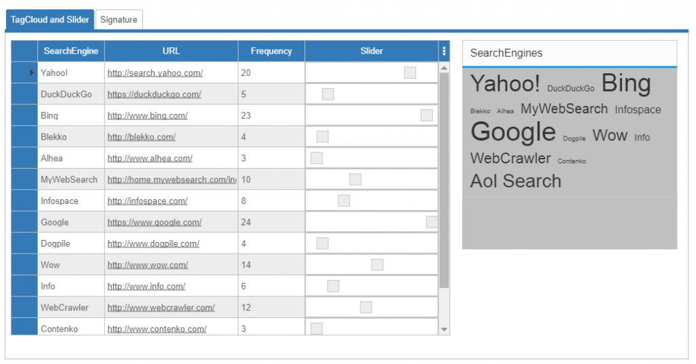
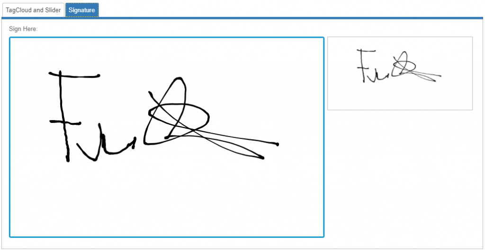

Integration2 (SyncFusion)
====

Example application to demonstrate the integration of SyncFusion controls into Wisej and how to use them in server side code.
Shows controls ejTagCloud, ejSlider, ejSignature

Find a blog with detailed explanation of the code here: https://wisej.com/blog/integration2/

Learn more about SyncFusion http://www.syncfusion.com/

Run it online: http://demo.wisej.com/Integration2

License
-------
 Copyright (C) ICE TEA GROUP LLC, All rights reserved.
