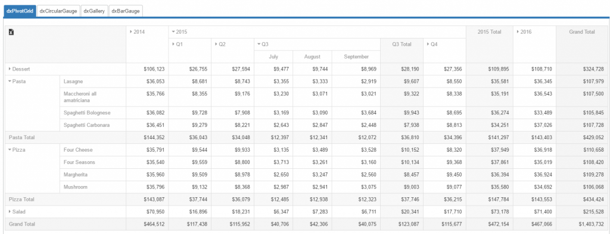
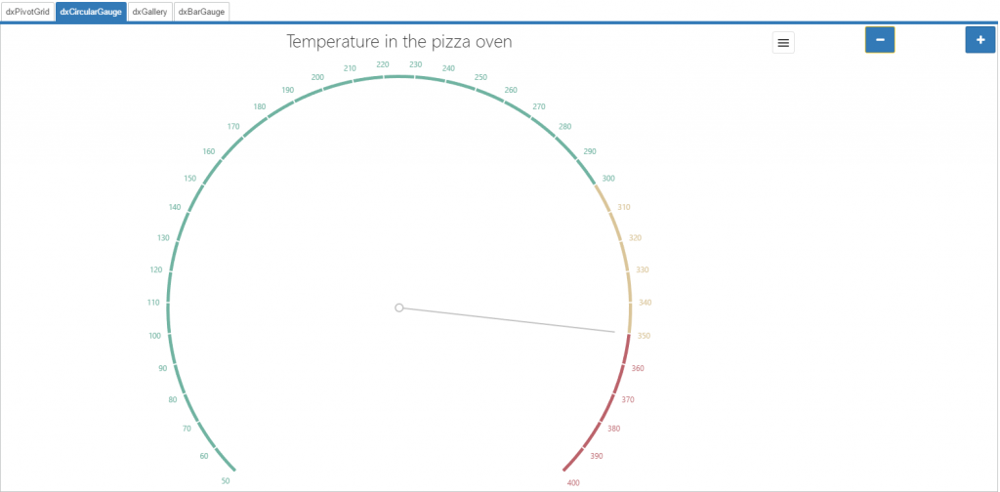
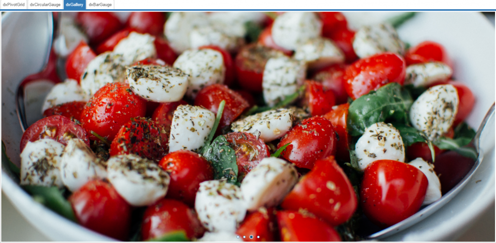
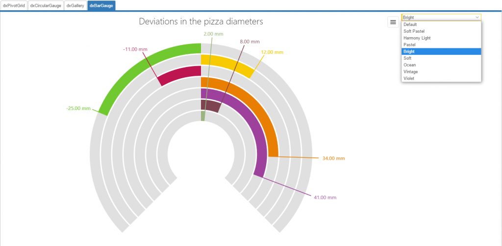

Integration1 (DevExpress)
====

Example application to demonstrate the integration of DevExtreme controls into Wisej and how to use them in server side code.
Shows controls dxPivotGrid, dxCircularGauge, dxBarGauge, dxGallery

Find a blog with detailed explanation of the code here: https://wisej.com/blog/integration1/

Learn more about DevExtreme by DevExpress: https://js.devexpress.com/

Run it online: http://demo.wisej.com/Integration1

License
-------
 Copyright (C) ICE TEA GROUP LLC, All rights reserved.
