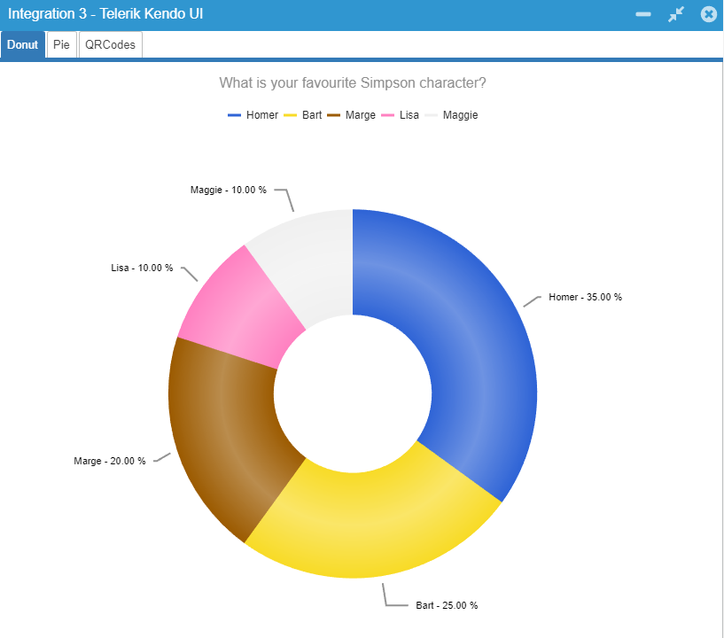
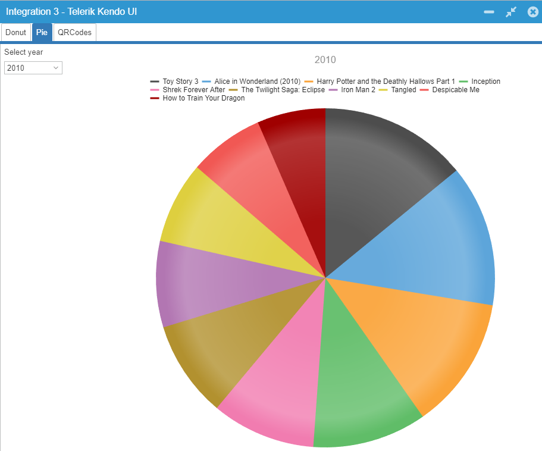
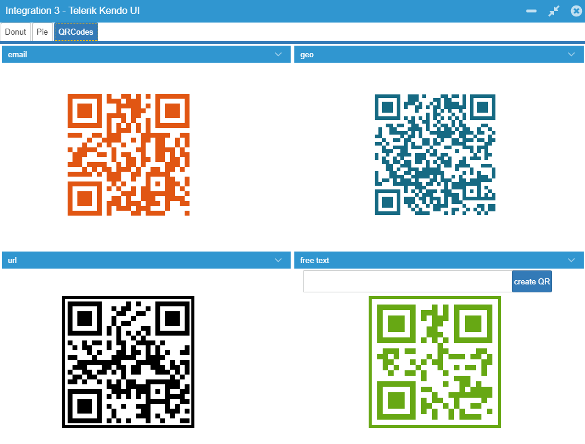

Integration3 (Telerik Kendo UI)
====

Example application to demonstrate the integration of Telerik Kendo UI controls into Wisej and how to use them in server side code.
Shows controls 

Find a blog with detailed explanation of the code here: https://wisej.com/blog/all-about-integration-part-3/

Learn more about Telerik Kendo UI: https://www.telerik.com/kendo-ui

Run it online: http://demo.wisej.com/Integration3

License
-------
 Copyright (C) ICE TEA GROUP LLC, All rights reserved.
