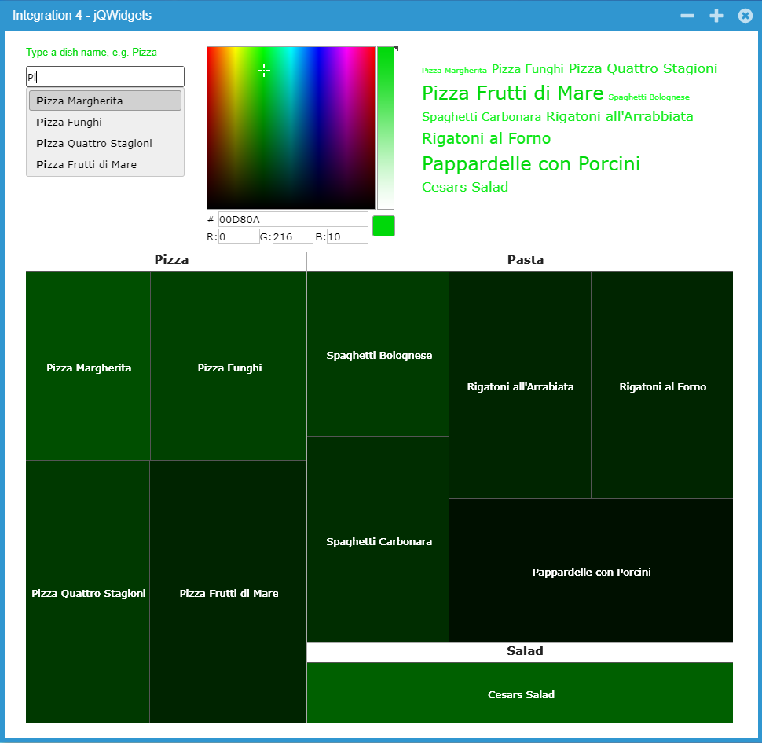

Integration4 (jQWidgets)
====

Example application to demonstrate the integration of jQWidgets controls into Wisej and how to use them in server side code.
Shows controls jqxInput, jqxColorPicker, jqxTreeMap

Find a blog with detailed explanation of the code here: https://wisej.com/blog/all-about-integration-part-4/

Learn more about jQWidgets: http://jqwidgets.com/

Run it online: http://demo.wisej.com/Integration4

License
-------
 Copyright (C) ICE TEA GROUP LLC, All rights reserved.
