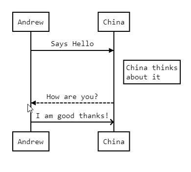

JSequence
====

The jSequence Diagram extension component turns text sequences into cool UML diagrams and detects clicks on any diagram element.
Uses 3rd party JavaScript library js-Sequence-Diagram

VB.NET
------
The VB.NET version is [here](https://github.com/iceteagroup/wisej-examples-vb/tree/main/JSequence)

License
-------
 Copyright (C) ICE TEA GROUP LLC, All rights reserved.
