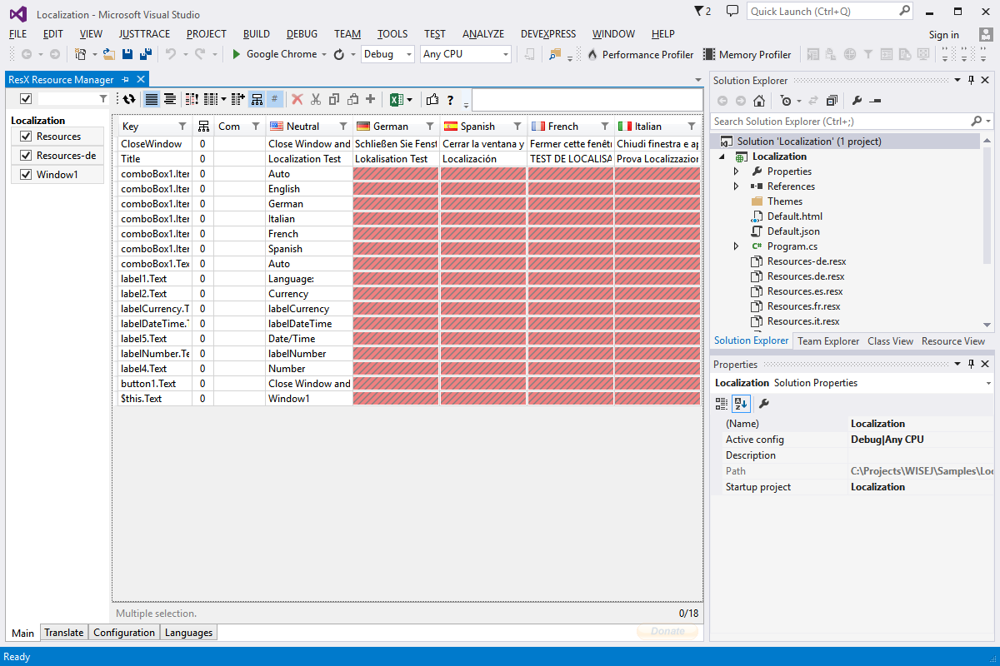

Localization
====

The Localization example shows how to take advantage of Visual Studio’s localization capabilities in a Wisej application. You can localize directly in the designer and/or use localized resources in the code.

License
-------
 Copyright (C) ICE TEA GROUP LLC, All rights reserved.
