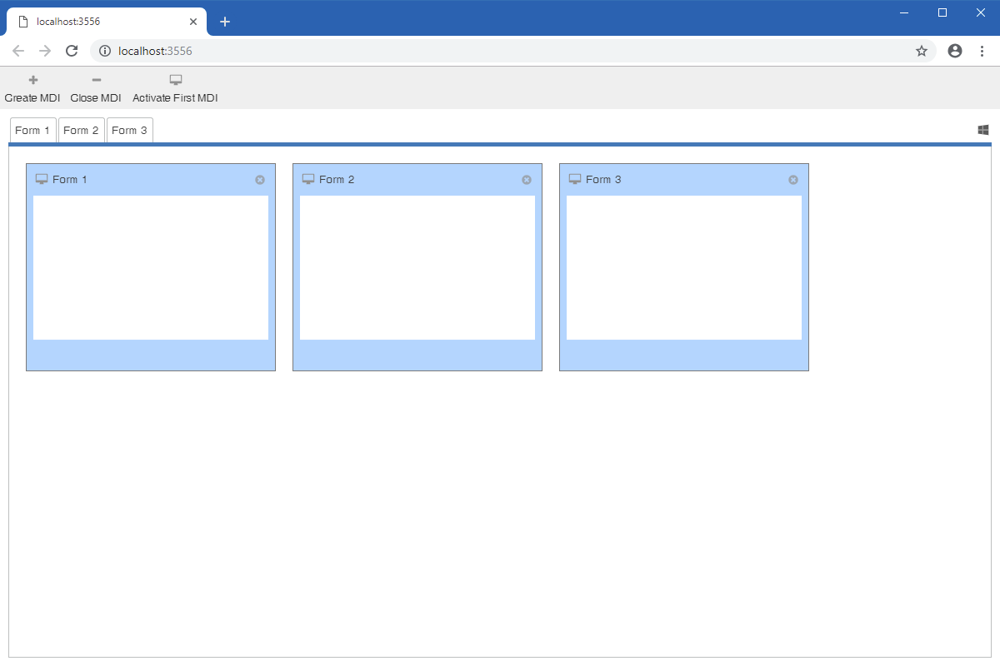

MDI Example
====

Shows how to build an MDI application. You should `Show` a `Form`, maximized it, hide the form control box, make it borderless, etc.

It also shows how to use a modeless Form.

License
-------
 Copyright (C) ICE TEA GROUP LLC, All rights reserved.
