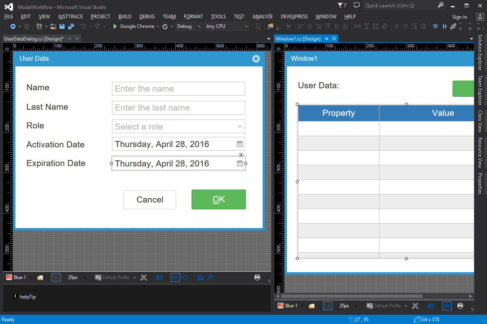

Modal Workflow
====

Modal workflow is impossible with any other web development framework on the market. It’s usually emulated using a combination of client side callbacks and ajax requests. Wisej supports full modal workflow and nested modal at any (configurable) level. The resulting code is much simpler, consistent and manageable.

License
-------
 Copyright (C) ICE TEA GROUP LLC, All rights reserved.
