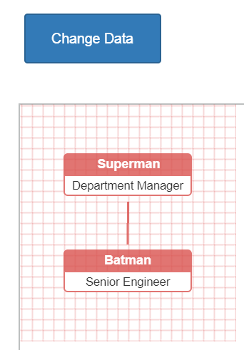

Integration of an OrgChart control
====

Example application to demonstrate the integration of an OrgChart control into Wisej and how to use them in server side code.

Find a discussion and detailed source code explanation in our support forum: https://wisej.com/support/question/would-be-great-to-have-a-orgchart-wisej-control

Learn more about OrgChart control: https://github.com/dabeng/OrgChart

License
-------
 Copyright (C) ICE TEA GROUP LLC, All rights reserved.
