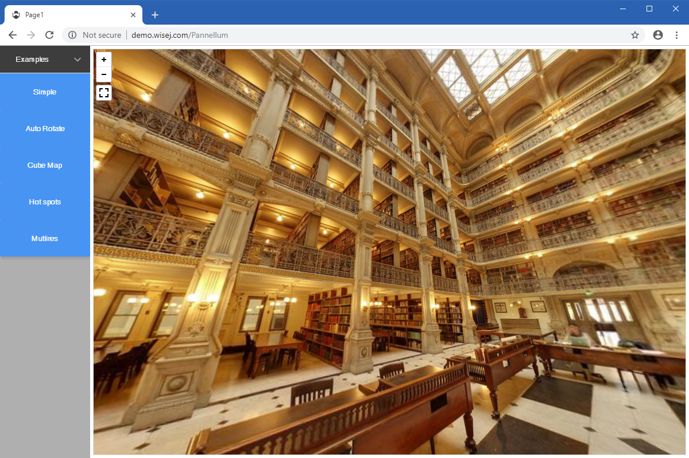

Pannellum
====

Shows how to use the [Pannellum](https://github.com/iceteagroup/wisej-extensions/tree/master/Wisej.Web.Ext.Pannellum) Wisej extension. The example application covers most common uses of this __panorama viewer__ for the web.

Uses 3rd party JavaScript library [Pannellum](https://pannellum.org/)

## [Try it on Online](http://demo.wisej.com/Pannellum)

License
-------
 Copyright (C) ICE TEA GROUP LLC, All rights reserved.
