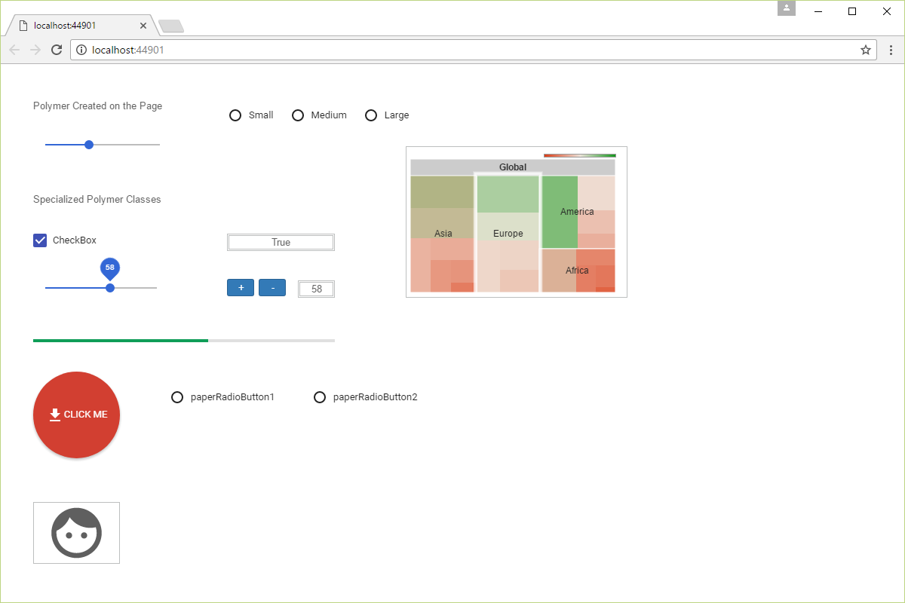

Polymer Example
====

Shows how to use the Polymer extension to create specialized Wisej WebComponent classes and to import non-visual Polymer libraries. Wisej WebComponent objects can receive events from the client and update most aspects of the Polymer Widgets.

Uses 3rd party JavaScript library [Web Components](https://www.webcomponents.org/)

License
-------
 Copyright (C) ICE TEA GROUP LLC, All rights reserved.
