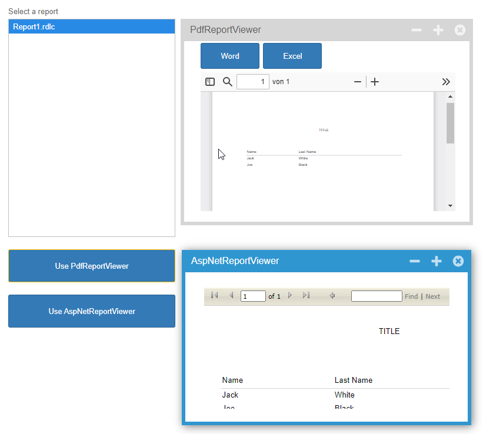

ReportViewer
====

This example shows how to use the Microsoft ReportViewer with a PDFViewer and an ASPNetWrapper.

VB.NET
------
The VB.NET version is [here](https://github.com/iceteagroup/wisej-examples-vb/tree/main/ReportViewer)

License
-------
 Copyright (C) ICE TEA GROUP LLC, All rights reserved.

