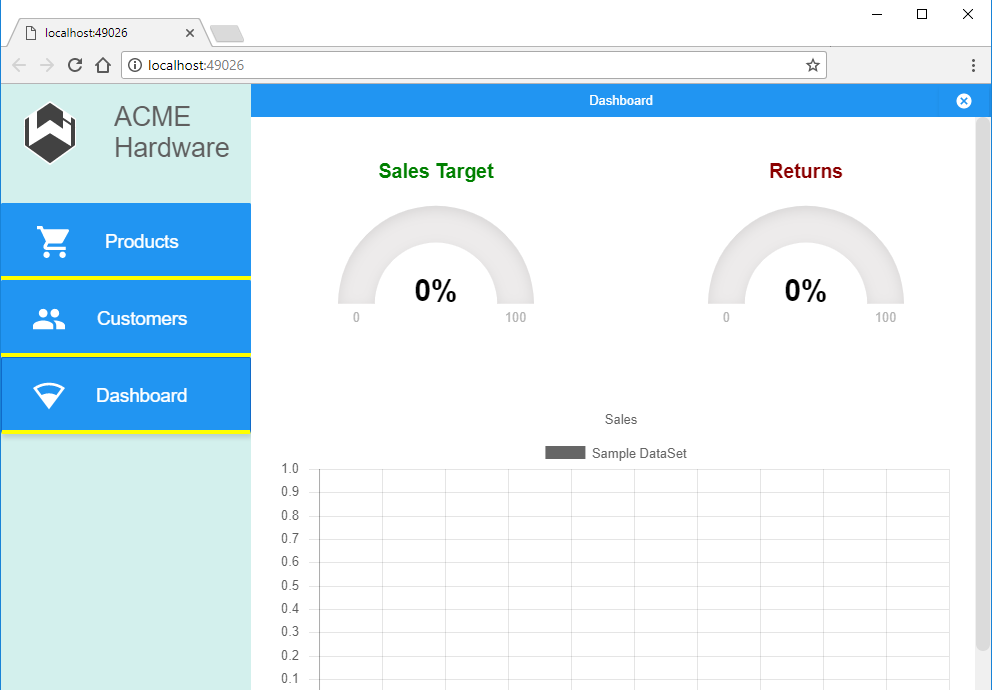

Responsive
====

Basic skeleton for a fully responsive app developed with Wisej. Take a close look at the ResponsiveProfileChanged event implemented for the login form and the OptionsPanel. Make sure to activate the developer tools in your browser and emulate different device profiles.

License
-------
 Copyright (C) ICE TEA GROUP LLC, All rights reserved.
