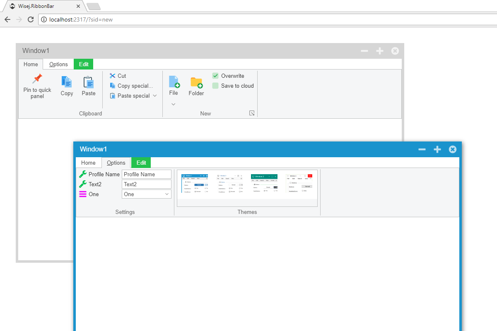

RibbonBar
====

Example application to demonstrate some of the features available to the [RibbonBar](https://github.com/iceteagroup/wisej-extensions/tree/master/Wisej.Web.Ext.RibbonBar) Wisej extension.

License
-------
 Copyright (C) ICE TEA GROUP LLC, All rights reserved.
