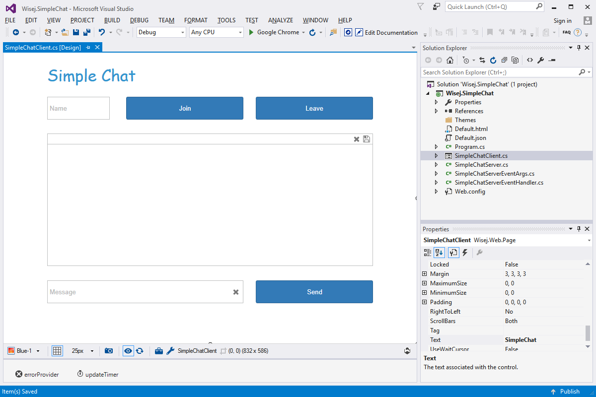

Simple Chat
====

Very simple chat server and client. Demonstrates how to fire and handle shared events and update multiple clients at once. Can be used as a base for broadcast notifications or a simple chat feature to add to any application.

License
-------
 Copyright (C) ICE TEA GROUP LLC, All rights reserved.
