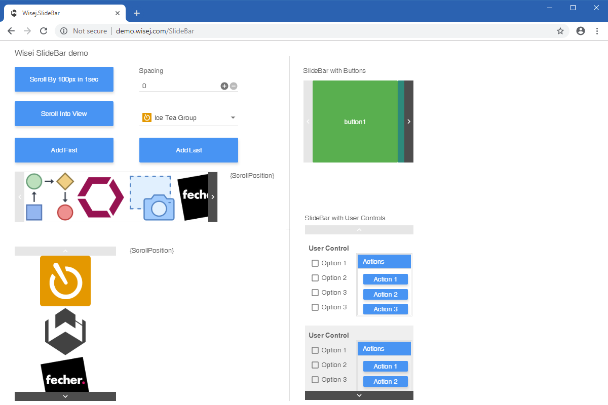

SlideBar
====

Shows how to use the new new __SlideBar__ control that can be used as a container for objects of virtually any type. Contained objects can be scrolled by arrow buttons, swiping or programmatically

## ["How to" blog](https://wisej.com/blog/wisej-slidebar/)

## [Try it on Online](http://demo.wisej.com/SlideBar)

License
-------
 Copyright (C) ICE TEA GROUP LLC, All rights reserved.
