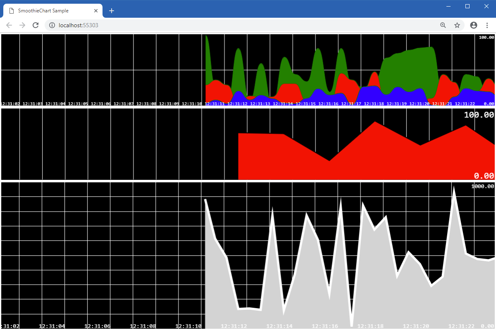

Smoothie Chart
====

Shows how to use the [SmoothieChart](https://github.com/iceteagroup/wisej-extensions/tree/master/Wisej.Web.Ext.SmoothieChart) Wisej extension. This example application charts multiple feeds of streaming data, using different font sizes.

Uses 3rd party JavaScript library [Smoothie Charts](http://smoothiecharts.org/) for charting streaming data

## [Try it on Online](http://demo.wisej.com/SmoothieChartSample)

License
-------
 Copyright (C) ICE TEA GROUP LLC, All rights reserved.
