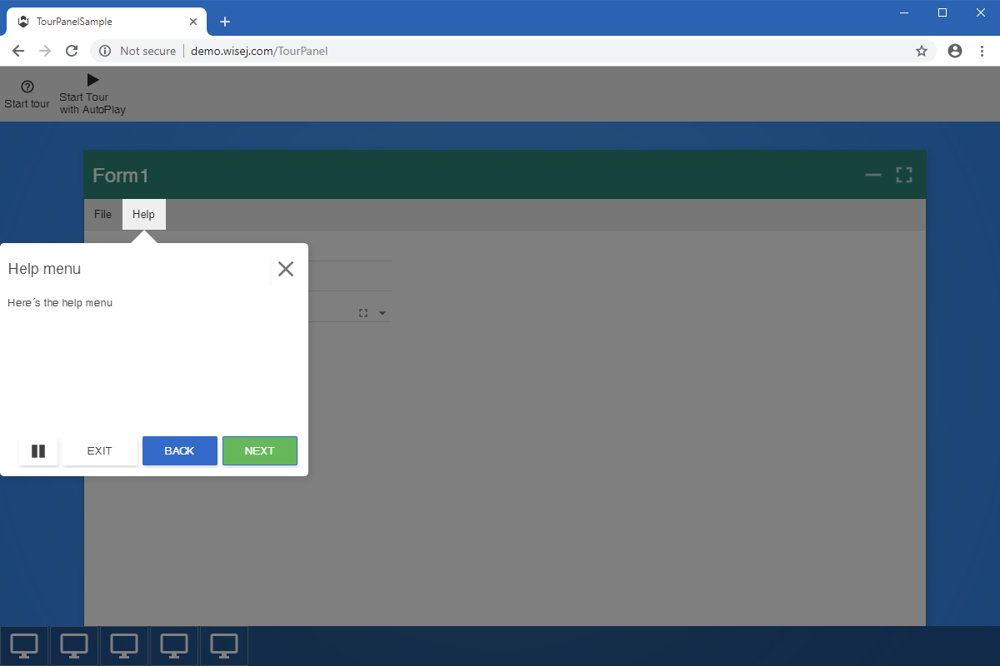

Tour Panel
====

The Tour Panel example shows how to use the [TourPanel](https://github.com/iceteagroup/wisej-extensions/tree/master/Wisej.Web.Ext.TourPanel) Wisej extension to create a guided tour of an application. A guided tour is organized in steps and step progression may be controlled by the user or may be set to automatic mode.

## [Try it on Online](http://demo.wisej.com/TourPanel)

License
-------
 Copyright (C) ICE TEA GROUP LLC, All rights reserved.
