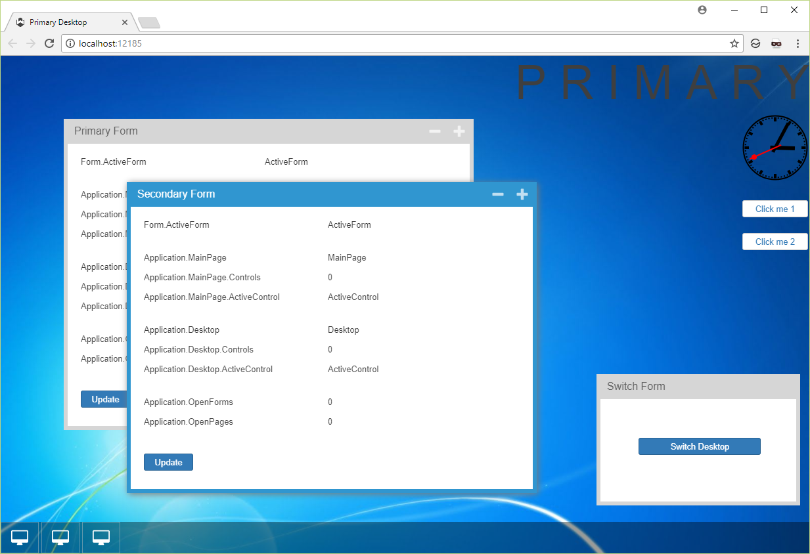

UI Containers
====

This sample explores 3 kinds of Wisej applications: Desktop, Page and Forms. It shows the relation between the containers and how to switch the active Desktop or the active Page while there are visible forms.

License
-------
 Copyright (C) ICE TEA GROUP LLC, All rights reserved.
