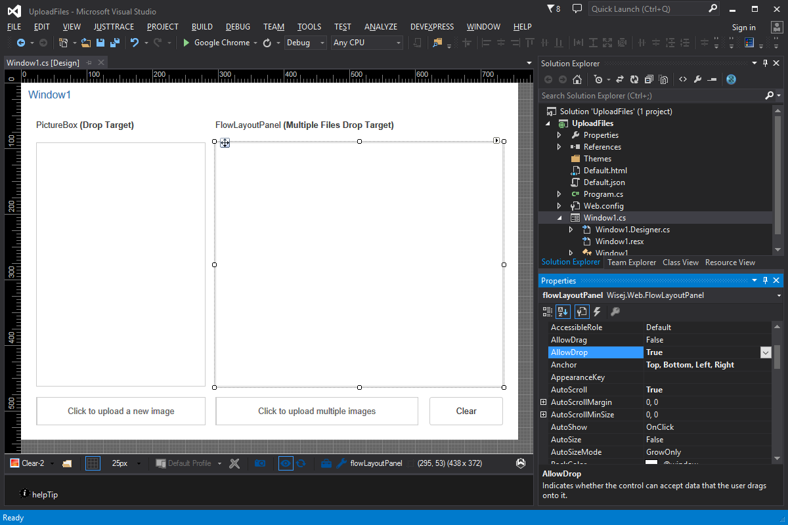

Upload Files
====

This example shows how easy it is with Wisej to upload a single or multiple files to the server. You can use a fully themeable upload widget or drag and drop the files from the desktop to any Wisej control. Wisej can also receive pre notifications from the client and inspect the names of the files being dropped.

## [Try it on Online](http://demo.wisej.com/UploadFiles)

License
-------
 Copyright (C) ICE TEA GROUP LLC, All rights reserved.
