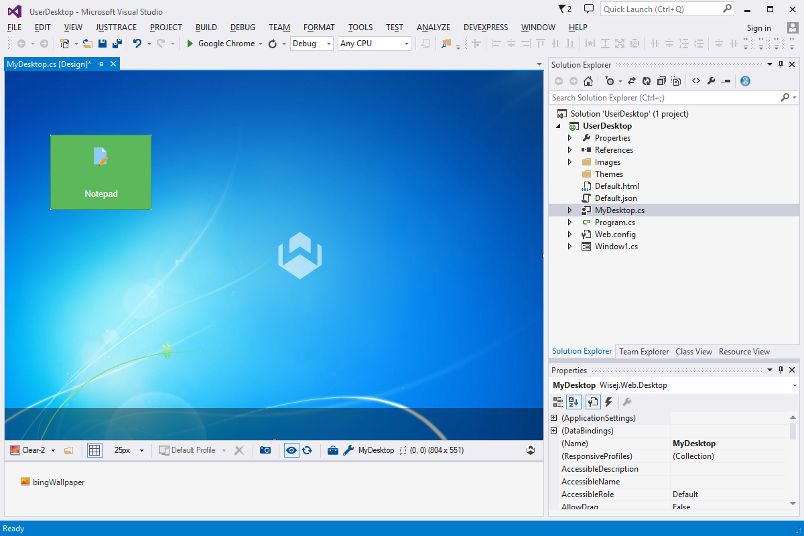

User Desktop
====

This example shows how to use the Wisej.Web.Desktop component to create a custom desktop. It has been extended with the [BingWallpaper](https://github.com/iceteagroup/wisej-extensions/tree/master/Wisej.Web.Ext.BingWallpaper) Wisej extension to show some very nice backgrounds.

License
-------
 Copyright (C) ICE TEA GROUP LLC, All rights reserved.
