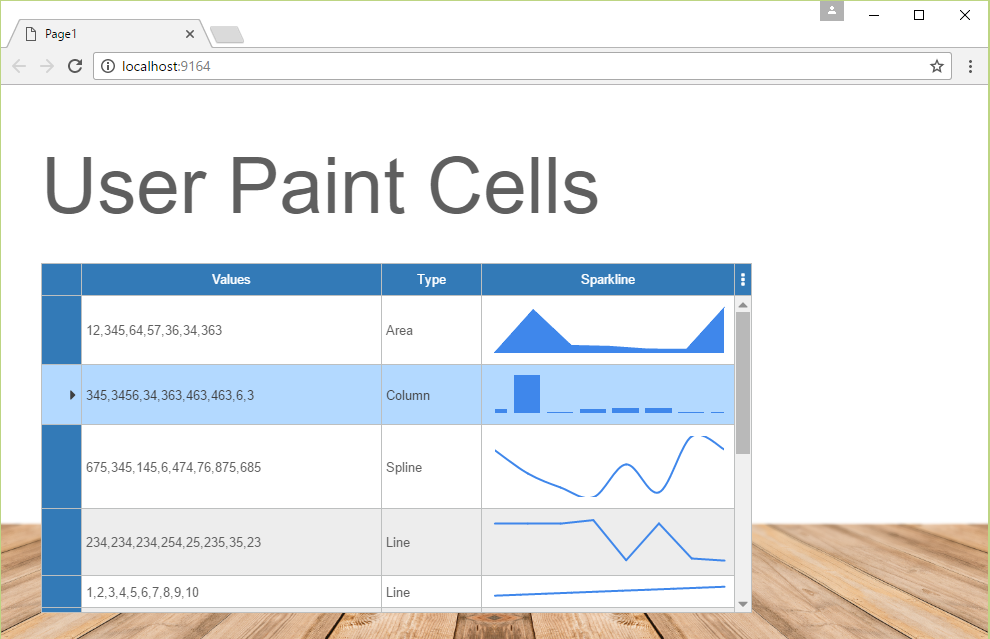

User Paint Cells
====

Shows the UserPaint feature supported by all DataGridView columns and cells. Additionally, this example demonstrates how to use the System.Web Chart control to draw sparkline-type charts inside cells.

License
-------
 Copyright (C) ICE TEA GROUP LLC, All rights reserved.
