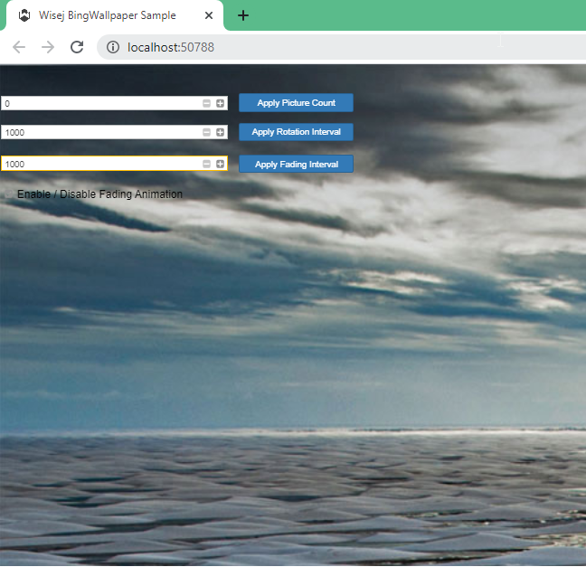

BingWallpaper
====

This example shows how to use the [Wisej.Web.Ext.BingWallpaper extension](https://github.com/iceteagroup/wisej-extensions/tree/2.2/Wisej.Web.Ext.BingWallpaper).

VB.NET
------
The VB.NET version is [here](https://github.com/iceteagroup/wisej-examples-vb/tree/main/BingWallpaper)

License
-------
 Copyright (C) ICE TEA GROUP LLC, All rights reserved.
