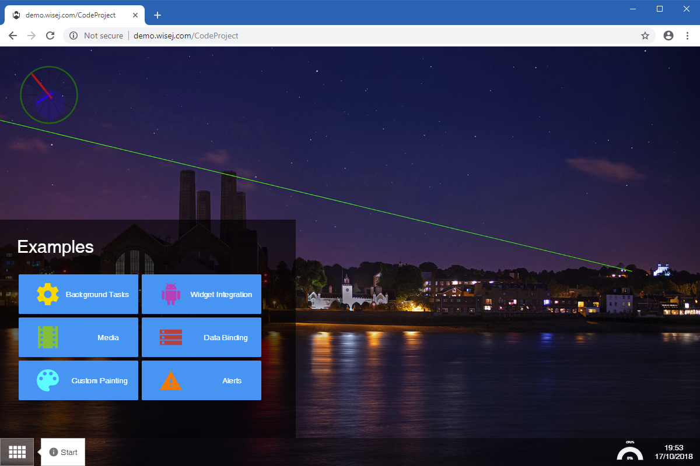

CodeProject
====

Sample application used for the [CodeProject](https://www.codeproject.com/Articles/1208339/Wisej-The-Easy-Button-for-Enterprise-Software) product review. Shows some of the many cool Wisej features. The sample uses SQLite x64, read the included Readme.txt to enable IIS Express x64 in Visual Studio.

## [Try it on Online](http://demo.wisej.com/CodeProject)

License
-------
 Copyright (C) ICE TEA GROUP LLC, All rights reserved.
