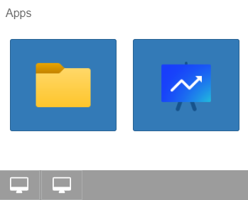

TaskBar
====

A TaskBar container that can be used outside of a Desktop widget to manage minimized floating windows without having to use a Desktop or a custom manager.

VB.NET
------
The VB.NET version is [here](https://github.com/iceteagroup/wisej-examples-vb/tree/main/TaskBar)

License
-------
 Copyright (C) ICE TEA GROUP LLC, All rights reserved.

